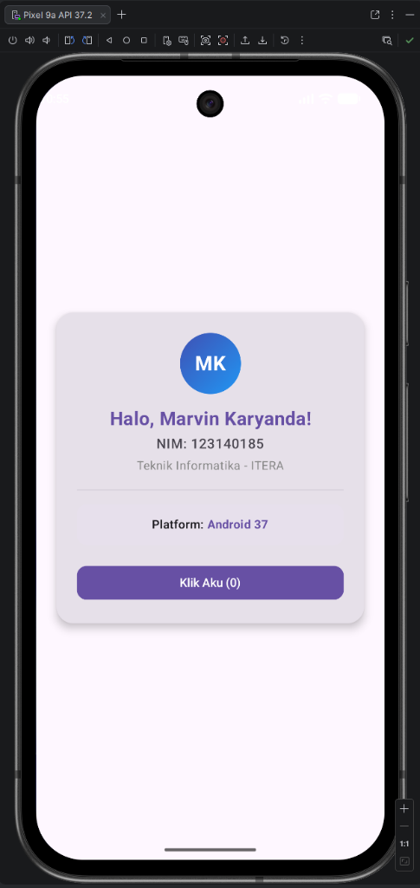
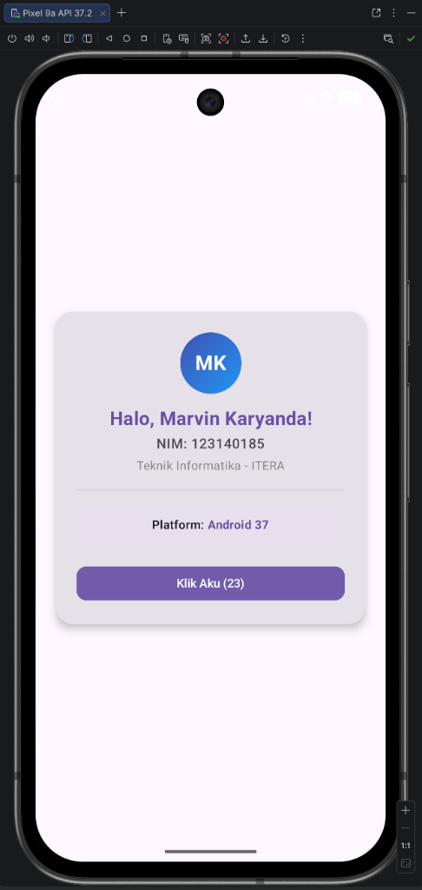

# Tugas Praktikum 1 — Pengenalan KMP & Setup Environment

## Identitas
- **Nama:** Marvin Karyanda
- **NIM:** 123140185
- **Kelas:** RA
- **Mata Kuliah:** Pengembangan Aplikasi Mobile (IF25-22017)

## Deskripsi Tugas
Modifikasi proyek dasar Kotlin Multiplatform (KMP) dengan Compose Multiplatform:
1. Menampilkan teks sapaan "Halo, Marvin Karyanda!".
2. Menampilkan NIM "123140185" dan Program Studi Teknik Informatika ITERA.
3. Mendeteksi dan menampilkan platform yang sedang menjalankan aplikasi menggunakan pola `expect`/`actual` KMP (Platform: Android).
4. Komponen UI interaktif menggunakan Compose Multiplatform (`remember`, `mutableStateOf`, `Card`, `Button`, `Modifier`).

---

## Dokumentasi & Preview Tampilan

| Kondisi Awal | Setelah Interaksi Klik |
|:---:|:---:|
|  |  |
