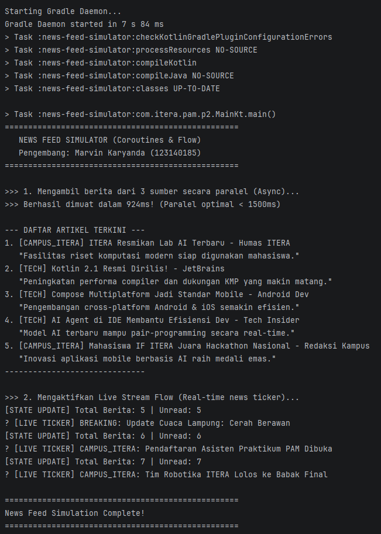

# Tugas Praktikum 2 — News Feed Simulator (Coroutines & Flow)

## Identitas
- **Nama:** Marvin Karyanda
- **NIM:** 123140185
- **Kelas:** RA
- **Mata Kuliah:** Pengembangan Aplikasi Mobile (IF25-22017)

## Fitur & Implementasi
1. **Parallel Data Fetching dengan Coroutines (`async` / `await`)**: Mengambil 3 sumber feed berita (Breaking News, Tech News, Campus News) secara bersamaan, memangkas waktu load menjadi < 1500ms (hasil eksekusi: ~924ms).
2. **Realtime Data Streaming dengan Kotlin Flow**: Menggunakan `Flow<NewsArticle>` dengan operator `filter`, `map`, dan `collect` untuk simulasi live news ticker berkala.
3. **State Management dengan StateFlow**: Menggunakan `MutableStateFlow` dan `StateFlow` untuk melacak status daftar artikel, filter kategori, dan unread count.

---

## Dokumentasi & Bukti Eksekusi Program

