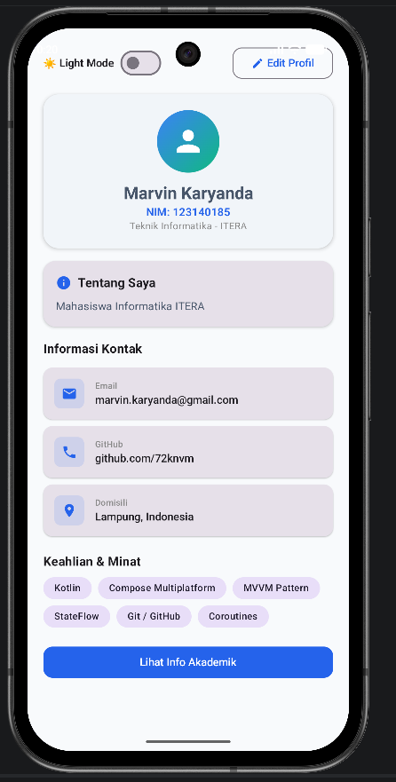
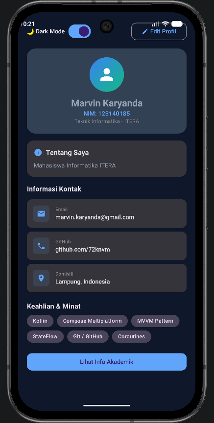
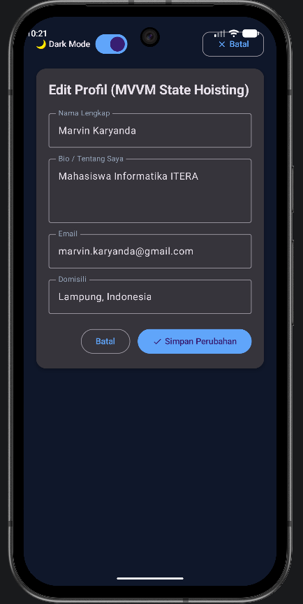

# Tugas Praktikum 4 — State Management (MVVM) & Dark Mode

## Identitas
- **Nama:** Marvin Karyanda
- **NIM:** 123140185
- **Kelas:** RA
- **Mata Kuliah:** Pengembangan Aplikasi Mobile (IF25-22017)

## Fitur & Implementasi Arsitektur
1. **Pola Arsitektur MVVM (Model-View-ViewModel)**:
   - **Model**: `ProfileUiState` data class yang immutable.
   - **ViewModel**: `ProfileViewModel` yang mengelola business logic dan state aplikasi dengan `MutableStateFlow` (private) dan `StateFlow` (public/read-only).
   - **View**: UI deklaratif Compose yang me-render state lewat `collectAsState()` dengan Unidirectional Data Flow (UDF).
2. **Fitur Edit Profil (State Hoisting)**:
   - Form interaktif dengan state hoisting yang memungkinkan perubahan data (Nama, Bio, Email, Domisili) dengan tombol Simpan & Batal.
3. **Dark Mode Toggle**:
   - Fitur dynamic theme switching yang disimpan di dalam `ProfileViewModel` dan merender `darkColorScheme` vs `lightColorScheme`.
4. **Bonus (+10%)**:
   - Transisi animasi state yang halus, Material 3 modern theme color tokens, dan expandable detail akademik.

---

## Dokumentasi & Preview Tampilan

| Light Mode | Dark Mode | Edit Profil (MVVM State) |
|:---:|:---:|:---:|
|  |  |  |
